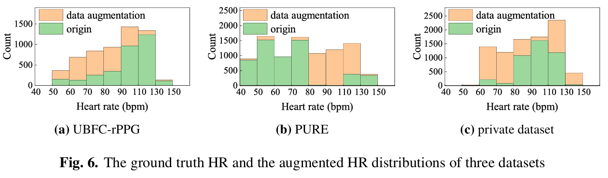
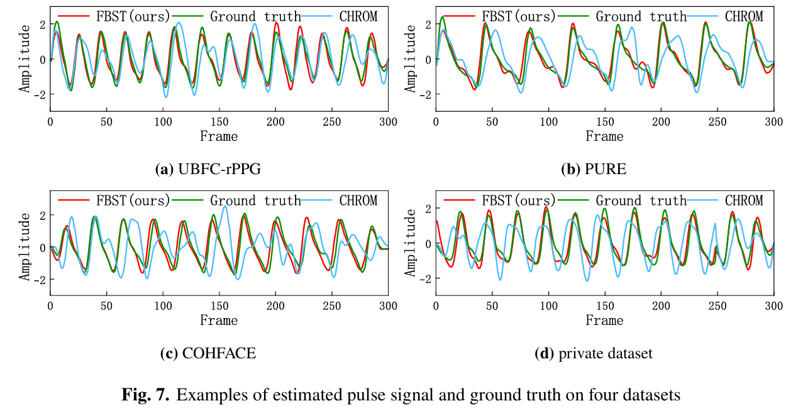

# Estimation of heart rate and respiratory rate by fore-background spatiotemproal modeling of videos


# Preprocessing:

This part of the code corresponds to the deriving raw signals module, which involves extracting the face, chest and background ROIs from the recorded video and forming a spatiotemporal map. For data balance, data enhancement methods are also utilized.

1. **signal_processing_method:** Including Fourier transform, Butterworth filter, frequency domain calculation of signal-to-noise ratio, are some basic signal processing methods

2. **process_face_bg_chest_videos:** The ROIs of face, chest and background were determined by positioning and tracking from the video

3. **spatiotemporal_map:** The ROIs obtained from step 2 forms a spatiotemporal_map

4. **data_augmentation:** data enhancement is performed by sampling the signal up and down

   

# Network framework: 

It is in the process of being sorted out and will be released soon

# tool_code:

Here are some of the tools code publicly available in the github repository, including unsupervised methods and neural methods, which we give the sources and references below:

- github link:https://github.com/ubicomplab/rPPG-Toolbox.git

- Citation:

  ```
  @article{liu2022rppg,  title={rPPG-Toolbox: Deep Remote PPG Toolbox},  author={Liu, Xin and Narayanswamy, Girish and Paruchuri, Akshay and Zhang, Xiaoyu and Tang, Jiankai and Zhang, Yuzhe and Wang, Yuntao and Sengupta, Soumyadip and Patel, Shwetak and McDuff, Daniel},  journal={arXiv preprint arXiv:2210.00716},  year={2022}}
  ```

  Results of remote pulse siganls:

  

